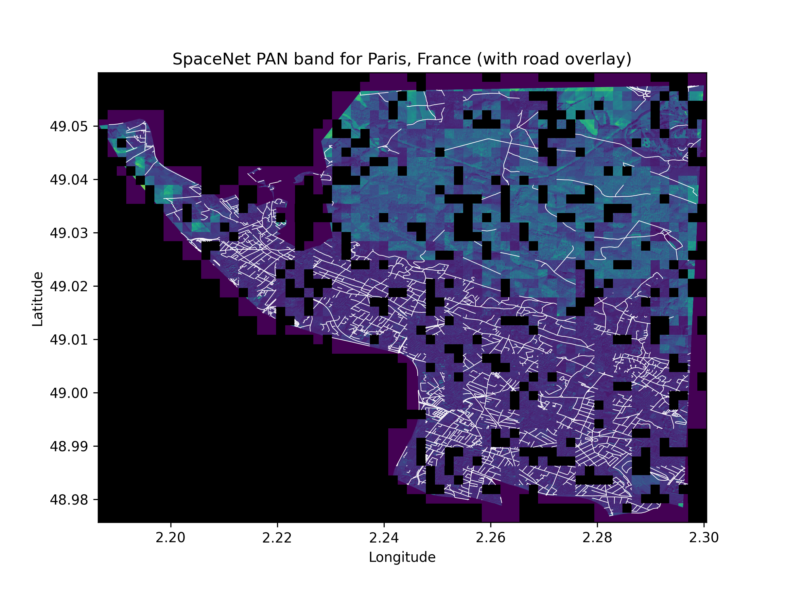

# SpaceNet visualization with GDAL

This is a demonstration of visualizing geospatial data, both geoTIFF and geoJSON, provided by [SpaceNet](https://spacenet.ai) with the [GDAL](https://gdal.org/python) library.

Note that some regions of the map below are blank because the data provided by SpaceNet is for an ML training challenge. 

## Installation
These GDAL installation instructions are for Mac OSX.

Install GDAL libraries with [Homebrew](https://brew.sh/) prior to installing GDAL pip package.

`brew install GDAL`

Create a Python venv and install packages. Install numpy prior to installing GDAL through the requirements.txt file.

`python -m venv venv/` \
`python -m pip install numpy` \
`python -m pip install -r requirements.txt`

## Download data

The data used in this experiment is provided by SpaceNet ([https://spacenet.ai/paris/](https://spacenet.ai/paris/)). The data is hosted on AWS. To download the data, create an AWS account, install the AWS CLI, and authenticate the CLI with your AWS account.

Download satellite data from AWS.

`aws s3 cp s3://spacenet-dataset/spacenet/SN3_roads/tarballs/SN3_roads_train_AOI_3_Paris_geojson_roads_speed.tar.gz .` \
`aws s3 cp s3://spacenet-dataset/spacenet/SN3_roads/tarballs/SN3_roads_train_AOI_3_Paris.tar.gz .` \
`aws s3 cp s3://spacenet-dataset/spacenet/SN2_buildings/tarballs/SN2_buildings_train_AOI_3_Paris.tar.gz .`

Expand the archives.

`tar -xf SN3_roads_train_AOI_3_Paris_geojson_roads_speed.tar.gz` \
`tar -xf SN3_roads_train_AOI_3_Paris.tar.gz` \
`tar -xf SN2_buildings_train_AOI_3_Paris.tar.gz`

## Run

The data processing and plotting code can be found in `spacent.py`.
